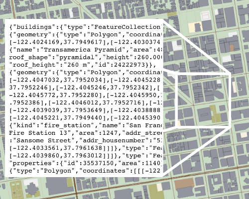

#Mapzen Vector Tiles

The [Mapzen vector tile service](https://mapzen.com/projects/vector-tiles) provides worldwide basemap coverage sourced from [OpenStreetMap](www.openstreetmap.org) and other open data projects, updated daily as a free & shared service.

Vector tiles are square-shaped collections of geographic data that contain the map feature geometry, such as lines and points. Information about how map features are drawn is maintained in a separate stylesheet file.

For many purposes, vector tiles are more flexible than raster tiles, which are images that already have the visual appearance of the map features pre-drawn. With vector tiles, there is no need to head back to the server and fetch a different set of tiles if you want to filter the output or change the style of a road or color of a building.

Vector tiles make real-time rendering possible by sending the underlying data geometry and tags directly to the client, whether that’s a browser or a native mobile app. Buildings and roads can be rendered in different ways, or not at all, when the vector tile is downloaded, and changes happen instantly on the client's side.

With vector tiles you have the power to customize the content and visual appearance of the map. We're excited to see what you build!

### Use Mapzen's Vector Tile Service

To start integrating vector tiles to your app, you need a [developer API key](https://mapzen.com/documentation/overview/).

* [API keys and rate limits](api-keys-and-rate-limits.md) - Don't abuse the shared service!
* [Attribution requirements](attribution.md) - Terms of service for OpenStreetMap and other projects require attribution.

#### Requesting tiles

The URL pattern to request tiles is:

`https://tile.mapzen.com/mapzen/vector/v1/{layers}/{z}/{x}/{y}.{format}`

Here’s a sample tile in TopoJSON:

`https://tile.mapzen.com/mapzen/vector/v1/all/16/19293/24641.topojson`

More information is available about how to [use the vector tile service](use-service.md) and specify custom layers in the service (though we recommend the default `all` layer).

##### Formats

The Mapzen vector tile service provides [tiles in a variety of formats](use-service.md#formats), including GeoJSON, TopoJSON, and MVT binary.

**We recommend** `TopoJSON` format for desktop web development, and `MVT` format for native mobile development. The Mapzen server gzips tiles automatically, so the TopoJSON file format is comparable in file size to MVT over the wire, and it's much friendlier to debug.

##### Drawing a map

How to [draw the tile](display-tiles.md) in a browser is up to the vector-friendly visualization tool, such as SVG, Canvas, or WebGL. The [Tangram](https://mapzen.com/projects/tangram) rendering engine, which uses WebGL, is one way that you can draw the vector tile service in 2D and 3D maps.

### How are vector tiles produced?

Vector tiles are served by clipping geometries to the tile bounding box, and then simplified to match the zoom level to avoid unnecessary complexity at lower zoom levels. These geometries and features are also further processed to facilitate styling.

When changes are made to OpenStreetMap or another map [data sources](data-sources.md), rather than waiting for an image tile to be redrawn, only the geometry coordinates and feature attributes for that particular building or road need to be updated in the vector tile.

Depending on the URL syntax, Mapzen vector tiles can return all of the map data, or just individual [layers](layers.md), or combinations of layers, including water, earth, landuse, roads, buildings and points of interest.

### Build from source

If you are interested in setting up your own version of this service, follow these [installation instructions](https://github.com/mapzen/vector-datasource/wiki/Mapzen-Vector-Tile-Service).

### Credits

This is based on the work of [Michal Migurski](http://mike.teczno.com/), and extends his [OSM.US-hosted vector tile service](http://openstreetmap.us/~migurski/vector-datasource/) with additional data and format support.
